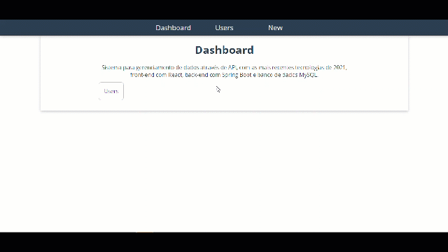

<p align="center">
  
</p>

<p align="center"> 
  
  
  <a href="https://github.com/rafaelfachinelli">
    
  </a>
  
</p>

<p align="center">
 <a href="#eye_speech_bubble-preview">Preview</a> •
 <a href="#information_source-about">About</a> •
 <a href="#memo-tasks">Tasks</a> •
 <a href="#arrow_forward-run">Run</a> •
 <a href="#hammer_and_wrench-technologies">Technologies</a> •
 <a href="#boy-author">Author</a> •
 <a href="#balance_scale-license">License</a>
</p>

---
## :eye_speech_bubble: **Preview**

<div align="center">

### :desktop_computer: Computer
  
|Desktop|
|:---:|
|<kbd></kbd>|

### :iphone: Responsive

|Tablet|
|:---:|
|<kbd></kbd>|

</div>
  
---
## :information_source: About

System for data management through API, with the most recent technologies from 2021, front-end with React, back-end with Spring Boot and MySQL database.

---
## :memo: **Tasks**

<div align="center">
<details>
<summary>Click to View</summary>

|State|Task|
|:---:|:---|
|:heavy_check_mark:|Describe your task finished.|
|:x:|Describe your task unfinished.|

</details>
</div>

---
## :arrow_forward: **Run**

To run the **web** project you need to download this repository, have the Node Package Manager ([`NPM`](https://www.npmjs.com/get-npm)) or the YARN Package Manager installed ([`YARN`](https://yarnpkg.com/getting-started)).

### :desktop_computer: **WEB**

Open the command prompt in the project directory, open the [`web/`](web/) folder and execute the following commands:

<details>
  <summary><i>with <b>npm</b></i></summary>
  
  ```bash
  # Install dependencies
  $ npm install

  # Start development server
  $ npm start
  ```
  
</details>

<details>
  <summary><i>with <b>yarn</b></i></summary>
  
  ```bash
  # Install dependencies
  $ yarn

  # Start development server
  $ yarn start

  ```

</details>

> ⚠️ The development server will start on port:3000 - Access <http://localhost:3000>

---
## :hammer_and_wrench: **Technologies**

The following tools is used to build this project:

<div align="center">

|:globe_with_meridians: Web|:file_cabinet: Server|
|:---:|:---:|
|[HTML5](https://exemple.com)|[JAVA](https://exemple.com)|
|[CSS3](https://exemple.com)|[JPA](https://exemple.com)|
|[TypeScript](https://exemple.com)|[Maven](https://exemple.com)|
|[React](https://exemple.com)|[Spring Tool Suite 4](https://exemple.com)|
|[React Router DOM](https://exemple.com)|[Spring Boot 2](https://exemple.com)|
|[Styled Components](https://exemple.com)|[Hibernate](https://exemple.com)|
|[Axios](https://exemple.com)||

</div>

---
## :boy: **Author**

<div align="center">

<a href="https://github.com/rafaelfachinelli">
 
 <br/>
 <sub><b>Rafael Fachinelli</b></sub>
</a>

Developed with ❤️ by Rafael Fachinelli 👋🏽 Contact me!

[](https://www.linkedin.com/in/rafaelfachinelli)
[](https://github.com/rafaelfachinelli)
[](mailto:rafael.fachinelli@fatec.sp.gov.br)

</div>

---
## :balance_scale: **License**

<div align="center">

Copyright © 2021 [Rafael Fachinelli](https://github.com/rafaelfachinelli).<br />
This project is licensed by [MIT](./LICENSE).

</div>
